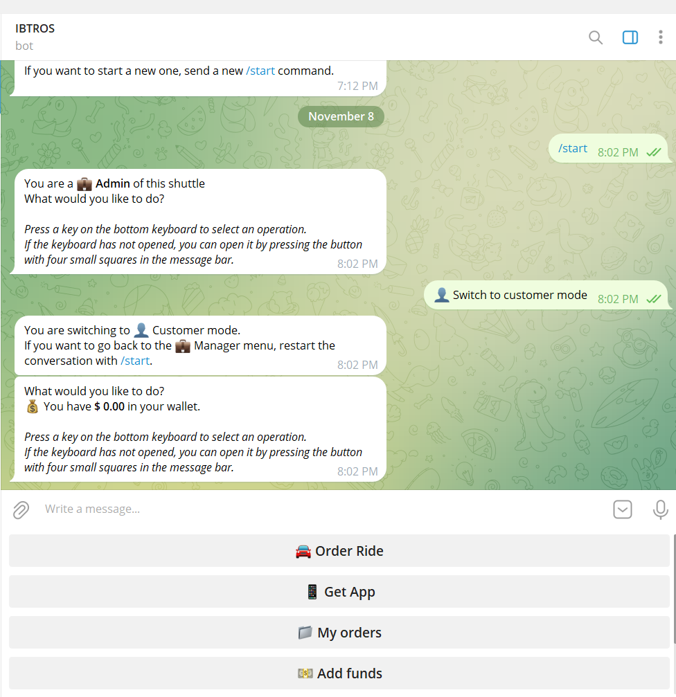
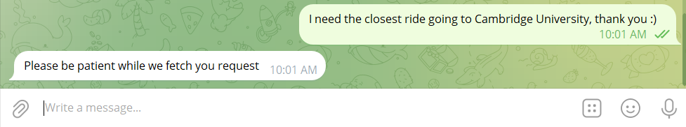
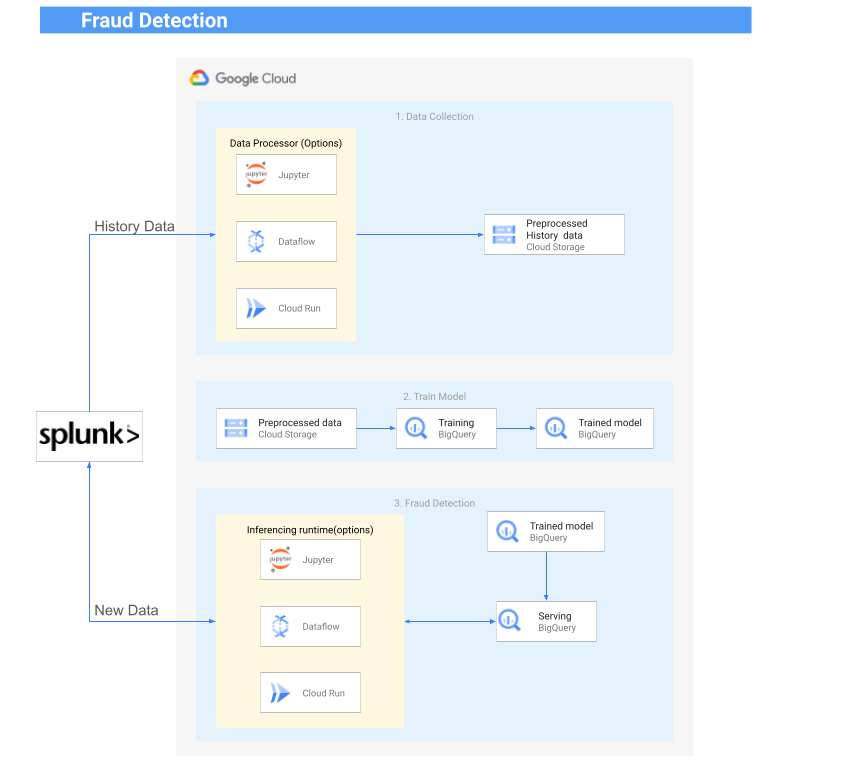

# IBTROS Application Setup and Usage

The IBTROS application is divided into two main components: IBTROS_Telegram and IBTROS-Splunk-BigQuery-Fraud-Detection.


### Natural language with Fraud (Anomaly) detection using Splunk at pilot side 

|  |  |
|-------------------------|------------------------|
| Converse naturally with prompt        | Get response from db  |




## Setup Instructions

### Clone repository

```bash 
git clone https://github.com/Jerryblessed/gemini_IBTROS.git
```

### Navigate to the IBTROS_Telegram Directory:
```bash 
cd ./IBTROS_telegram
```

### Run the Core Application:
```bash 
python core.py
```

##  Gemini 1.5 Feature:

###  The Gemini 1.5 feature can be found in worker.py under the method definition:
```bash 
def __order_menu(self):
```
The method is called in the core.py file, in the method definition:
   

# Fraud Detection with Splunk and BigQuery

Thanks to google cloud big query and splunk, we can do anomaly detection on financial transactions.

This project shows how customers can use Splunk and GCP BigQuery to do anomaly detection on financial transactions by ingesting data, training the model, and detecting the fraudulent transactions. Data used is randomly generated sample data without PII.

This project assumes that you already have a Splunk instance and a GCP BigQuery table. The creation, maintenance, and deletion of these upstream resources are outside the scope of this project.

### Fraud (Anomaly) Detection with Splunk 


### Results
_might take few seconds to load the media_


### Generate some data
```bash 
# start_date = '2023-01-01'
# end_date = '2023-03-31'
python datagen.py
```

### Load generated data to BigQuery


### Create Model for Anomaly Detection in BigQuery
Execute the ```create_model.sql``` script in BigQuery

### Generate some more data that will be ingested to Splunk
```bash 
# start_date = '2023-04-01'
# end_date = '2023-04-3'
python datagen.py
```

### Start ingesting generated data to Splunk using REST APIs
```bash 
python splunk-ingest.py
# This ingest to main index
# this will ingest one record every 5 seconds
```

### Use Model to detect anomalies on new data
While splunk-ingest.py is running, Open ```Splunk.ipynb``` and run the cells.
``` 
 0. Create index named 'anomalies' in Splunk and update the token in the notebook
 1. Create a Search Job and Get SID from Splunk ( adjust time range in the notebook)
 2. Get Results for the SID
 3. Detect Anomaly using our trained model inBigQuery 
 4. Post new detected anomalies to Splunk
``````
Results


### License
Copyright 2024 Google LLC

Licensed under the Apache License, Version 2.0 (the "License");
you may not use this file except in compliance with the License.
You may obtain a copy of the License at

    https://www.apache.org/licenses/LICENSE-2.0

Unless required by applicable law or agreed to in writing, software
distributed under the License is distributed on an "AS IS" BASIS,
WITHOUT WARRANTIES OR CONDITIONS OF ANY KIND, either express or implied.
See the License for the specific language governing permissions and
limitations under the License.
